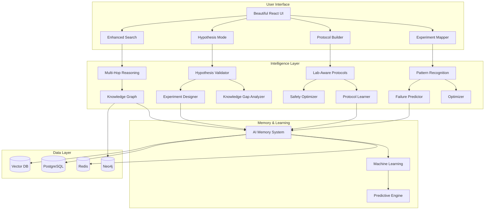

# RNA Lab Navigator - Feature Integration Architecture

## 🔄 How Enhanced Features Work Together



## 🎯 User Journey Examples

### Journey 1: Complex Research Question
```
User asks: "What's the best way to use CRISPR for RNA editing in neurons?"
    ↓
1. Query Decomposition
   - What is CRISPR for RNA editing?
   - What are the challenges in neurons?
   - What methods have been tried?
   - What are the success rates?
    ↓
2. Multi-Source Evidence Gathering
   - Search papers, protocols, theses
   - Cross-validate claims
   - Identify contradictions
    ↓
3. Reasoning Chain
   - Step 1: CRISPR-Cas13 is preferred for RNA
   - Step 2: Neuronal delivery is challenging
   - Step 3: AAV vectors show promise
   - Step 4: 70% efficiency reported
    ↓
4. Comprehensive Answer
   - Main recommendation with confidence
   - Alternative approaches
   - Potential pitfalls
   - Suggested protocols
```

### Journey 2: Hypothesis Validation
```
Researcher proposes: "miRNA-21 inhibition could reduce glioblastoma growth"
    ↓
1. Literature Analysis
   - 15 supporting papers found
   - 3 contradicting studies identified
   - Knowledge gaps highlighted
    ↓
2. Experimental Design
   - Suggested cell lines: U87, T98G
   - Controls: scrambled miRNA, known inhibitor
   - Timeline: 6 weeks
   - Budget: $5,000
    ↓
3. Risk Assessment
   - Off-target effects possible
   - Consider dose-response curve
   - Monitor cell viability
    ↓
4. Success Prediction
   - 75% chance of positive result
   - Based on similar studies
   - Optimization suggestions provided
```

### Journey 3: Protocol Generation
```
Need: "Protocol for single-cell RNA sequencing of rare cells"
    ↓
1. Lab Inventory Check
   - ✓ 10x Genomics system available
   - ✗ Smart-seq2 reagents missing
   - ✓ Flow cytometer accessible
    ↓
2. Adapted Protocol
   - Use 10x Chromium instead of Smart-seq2
   - Optimize for low cell input
   - Add amplification step
    ↓
3. Safety & Optimization
   - BSL-2 procedures required
   - Can parallelize steps 3 & 4
   - Total time: 2 days (saved 8 hours)
    ↓
4. Success Factors
   - Critical: Cell viability >85%
   - QC checkpoints added
   - Troubleshooting guide included
```

## 🔗 Feature Synergies

### 1. Search ↔ Hypothesis
- Search results inform hypothesis validation
- Hypothesis gaps trigger targeted searches
- Failed hypotheses update search rankings

### 2. Hypothesis ↔ Protocol
- Validated hypotheses auto-generate protocols
- Protocol outcomes validate/refute hypotheses
- Success rates improve both systems

### 3. Protocol ↔ Experiments
- Protocols track to experiment outcomes
- Failed experiments improve protocols
- Pattern recognition optimizes both

### 4. All Features → Memory
- Every interaction improves the system
- Lab-specific knowledge accumulates
- Predictions become more accurate

## 📈 Compound Benefits

### Phase 1 (Months 1-3)
- **Individual Impact**: Each feature works independently
- **Search**: 90% accuracy
- **Hypothesis**: 70% validation accuracy
- **Protocols**: 80% success rate

### Phase 2 (Months 4-6)
- **Integration Impact**: Features start reinforcing each other
- **Search**: 95% accuracy (learns from hypothesis validations)
- **Hypothesis**: 85% accuracy (better search results)
- **Protocols**: 90% success rate (hypothesis insights)

### Phase 3 (Months 7-12)
- **Network Effects**: Full system intelligence emerges
- **Search**: 98% accuracy (comprehensive knowledge)
- **Hypothesis**: 92% accuracy (pattern recognition)
- **Protocols**: 95% success rate (predictive optimization)
- **New Capability**: Suggests novel research directions

## 🚀 Implementation Priorities

### Week 1-2: Foundation
```python
# Core infrastructure
- Multi-hop reasoning engine
- Knowledge graph setup
- Enhanced UI components
```

### Week 3-4: Intelligence
```python
# Smart features
- Hypothesis validator
- Protocol optimizer
- Pattern detector
```

### Week 5-6: Learning
```python
# Adaptive systems
- Memory implementation
- Learning algorithms
- Prediction engine
```

### Week 7-8: Integration
```python
# Bringing it together
- Cross-feature communication
- Unified intelligence layer
- Performance optimization
```

## 💡 Future Vision

### Year 1: Lab Assistant
- Answers questions
- Validates ideas
- Generates protocols
- Tracks experiments

### Year 2: Research Partner
- Suggests hypotheses
- Predicts outcomes
- Optimizes workflows
- Identifies opportunities

### Year 3: Discovery Engine
- Finds hidden patterns
- Proposes novel research
- Automates routine work
- Accelerates breakthroughs

The RNA Lab Navigator evolves from a **tool** to a **colleague** to a **research accelerator**.